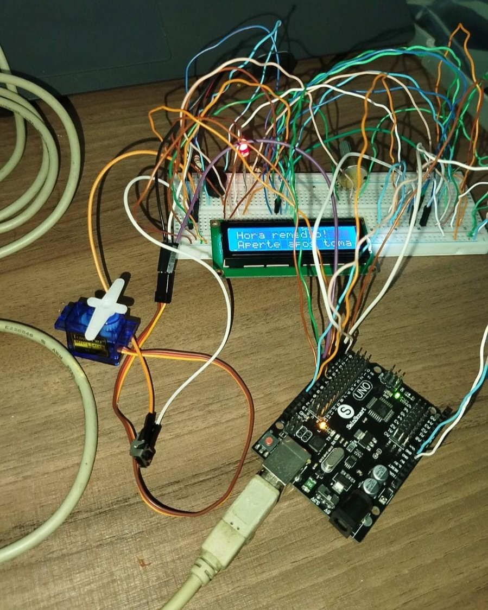
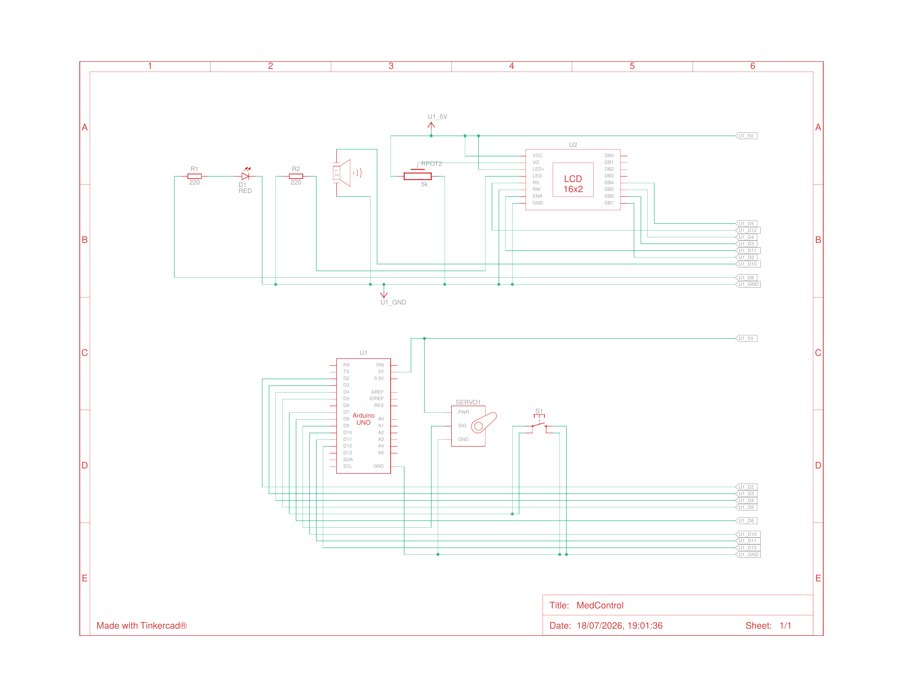

# MedControl — Farmácia Inteligente

Protótipo de farmácia inteligente construído com Arduino Uno, desenvolvido para auxiliar usuários na administração correta de medicamentos. O sistema aciona automaticamente a abertura de um compartimento no horário do medicamento, emite alertas sonoros e visuais, e só fecha depois que o usuário confirma a dose por meio de um botão físico.



---

## 📋 Sobre o projeto

| | |
|---|---|
| **Produto** | MedControl — Protótipo de Farmácia Inteligente |
| **Plataforma** | Arduino Uno R3 |
| **Prototipagem** | Tinkercad (simulação) + maquete física |
| **Disciplina** | Técnicas de Programação |
| **Semestre** | 2026.1 |
| **Status** | Protótipo funcional / maquete |

### Objetivo

Desenvolver um protótipo de farmácia inteligente utilizando Arduino, capaz de auxiliar usuários na administração correta de medicamentos por meio da automação da abertura do compartimento e da emissão de alertas sonoros e visuais.

---

## 🧩 Componentes utilizados

| Componente | Função | Qtd. |
|---|---|---|
| Arduino Uno R3 | Unidade central de processamento | 1 |
| Display LCD 16x2 | Exibição de informações ao usuário | 1 |
| Potenciômetro 5 kΩ | Ajuste de contraste do LCD | 1 |
| Servomotor (posicional) | Abertura/fechamento do compartimento | 1 |
| Piezo / Buzzer | Alerta sonoro | 1 |
| LED vermelho | Sinalização visual do alerta | 1 |
| Resistor 220 Ω | Proteção do LED / circuito | 2 |
| Push Button | Confirmação de dose tomada | 1 |
| Protoboard + Jumpers | Montagem do circuito | — |

> Na simulação do Tinkercad o alerta sonoro é reproduzido por um **piezo**; na montagem física, esse componente é substituído por um **buzzer**, mantendo exatamente a mesma lógica de firmware.

### Mapeamento de pinos

| Componente | Pino |
|---|---|
| Servomotor (sinal) | D9 |
| Piezo / Buzzer | D10 |
| LED indicador | D8 |
| Botão de confirmação | D7 |
| LCD — RS | D12 |
| LCD — Enable (E) | D11 |
| LCD — D4 | D5 |
| LCD — D5 | D4 |
| LCD — D6 | D3 |
| LCD — D7 | D2 |

---

## 🔌 Simulação no Tinkercad

O circuito completo foi projetado e validado no Tinkercad antes da montagem física.

🔗 **Link da simulação:** [Projeto no Tinkercad](https://www.tinkercad.com/things/ftH33SuNnAO-medcontrol?sharecode=Piq3hywgwHqZxrc1wp1MAs9D1p_18CyBY3xNzeBqxWE)



---

## ⚙️ Como usar

1. Instale a [Arduino IDE](https://www.arduino.cc/en/software).
2. Instale as bibliotecas necessárias pelo *Library Manager*:
   - `LiquidCrystal` (nativa da IDE)
   - `Servo` (nativa da IDE)
3. Abra o arquivo [`firmware/medcontrol.ino`](firmware/medcontrol.ino).
4. Monte o circuito conforme o mapeamento de pinos acima (ou replique a simulação do Tinkercad).
5. Selecione a placa **Arduino Uno** e a porta correta na IDE.
6. Faça o upload do código.

---

## 📁 Estrutura do repositório

```
medcontrol/
├── README.md
├── firmware/
│   └── medcontrol.ino
├── docs/
│   ├── MedControl.tex
│   └── MedControl.pdf
├── img/
│   ├── montagem_tinkercad.png
│   ├── diagrama_esquematico.png
│   ├── montagem-fisica.png
│   ├── esboco-inicial.png
│   └── prototipo-final.png
└── simulation/
    └── bom.csv
```

---

## 📄 Relatório completo

A documentação técnica completa do projeto (introdução, materiais, arquitetura, resultados, dificuldades e referências) está disponível em:

👉 [`docs/MedControl.pdf`](docs/MedControl.pdf)

---

## 🚧 Limitações atuais

- Não possui controle automático de horário (RTC); o ciclo de alerta é disparado a cada repetição do loop principal.
- Sem persistência de histórico de doses em memória não volátil.
- Estrutura física limitada a um único compartimento.
- Configuração remota via Wi-Fi ainda não implementada.

## 🔭 Melhorias futuras

- Adicionar módulo RTC para programação de horários reais.
- Configuração via Wi-Fi (ex.: ESP8266) para ajuste remoto de horários.
- Aplicativo/mobile companion para acompanhamento remoto de doses.
- Registro de histórico com cartão SD ou EEPROM.
- Expandir para múltiplos compartimentos com sensores de presença do comprimido.

---

## 👥 Equipe

- Conceição Tayná Medeiros da Silva
- Gislane Araújo Silva
- Luan Lopes dos Santos
- Rafael Esdras Nascimento Soares
- Viviane Freire Gomes
- Wendell Gomes dos Reis
- Yago Vinícius dos Santos Holanda

---

## 📚 Referências

- [Documentação oficial do Arduino](https://docs.arduino.cc)
- [Tinkercad Circuits](https://www.tinkercad.com)
- Datasheet do Arduino Uno R3
- Datasheet do Servomotor (posicional)
- Datasheet do Display LCD 16x2
- Datasheet do Buzzer/Piezo
